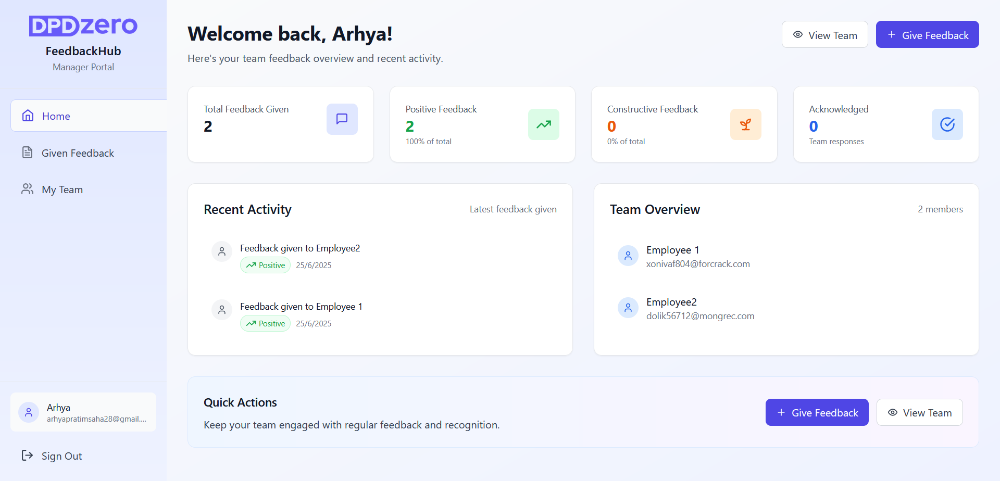
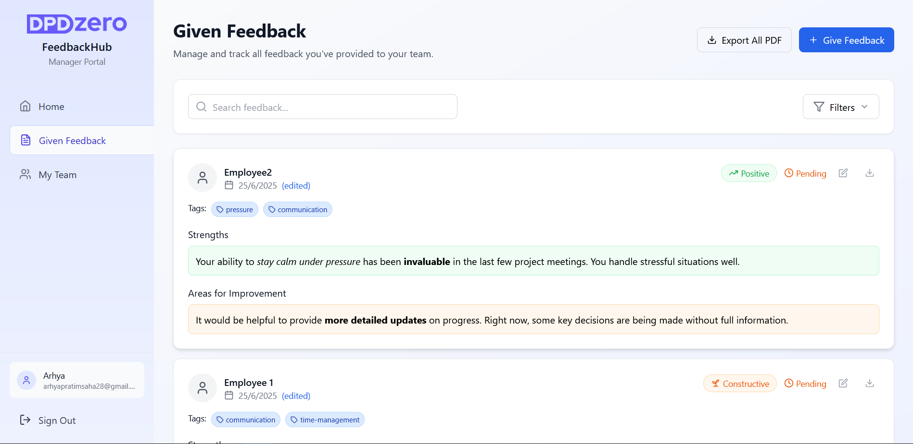
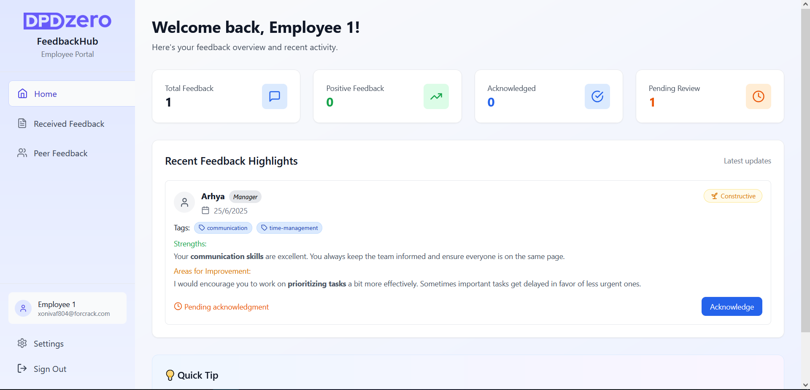
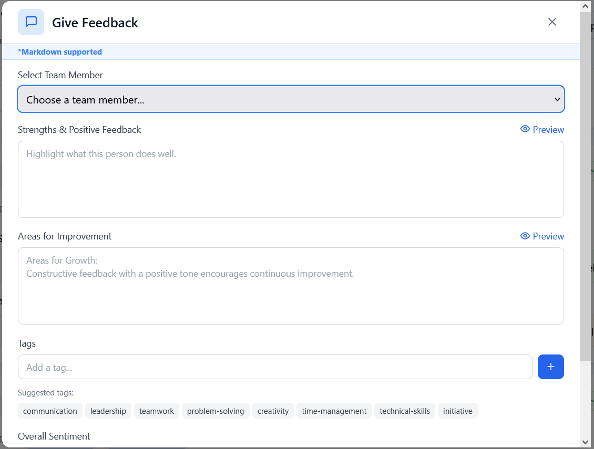
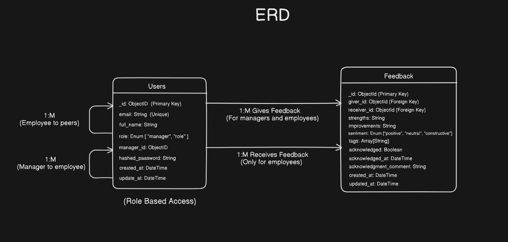
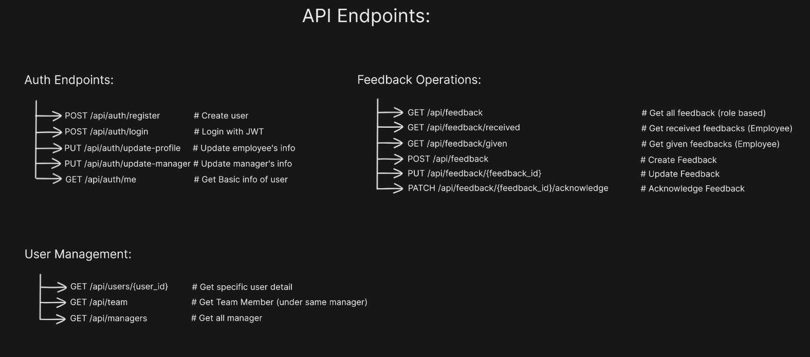

<div align="center">

# 🎯 FeedbackFlow

An assignment for DPD Full Stack Intern role.
A modern web app for transparent, structured feedback between managers and employees—enabling growth-focused conversations, sentiment tracking, and privacy with empathy.

</div>

---

### Capabilities

- **Role-based Authentication:** Manager and Employee roles with secure login.

- **Team Management:** Managers see only their team; employees see only their own feedback ;

- **Dashboard Analytics:** Visual statistics and insights tailored for both managers and employees.

- **Peer-to-Peer Feedback:** Employees can give feedback to peers, but only to those under the same manager.

- **Structured Feedback:** Managers submit feedback with strengths, areas to improve, and sentiment (positive/neutral/negative).

- **Feedback History:** Both roles see a timeline of all feedback.

- **Edit Feedback:** Managers and Employees can edit feedback after submission.

- **Acknowledge Feedback:** Employees acknowledge receipt of feedback.

- **Comment on Feedback:** Employees can add comments to feedback.

- **Anonymous Peer Feedback:** Option for anonymous feedback between peers.

- **Notifications:** Email or in-app alerts for new feedback.

- **Tagging:** Add predefined tags like "communication", "leadership", etc., or create custom tags as needed.

- **Export:** Download feedback as PDF.

- **Markdown Support:** Comments support markdown formatting.

---

### UI Screenshots

- Manager dashboard (team overview, sentiment trends)
- 
- Manager given feedback (timeline view)
- 
- Employee dashboard (feedback timeline)
  
- Employee Settings (profile, password change)
  
- Feedback modal (with reminders, required strengths)
  

---

### System Diagrams

- **ERD:** Entity-Relationship Diagram of users, feedback, comments, tags.
- 
- **API Endpoints:** REST API structure.
- 
- **Auth Flow:** Diagram showing login, role assignment, and access control.
- 

---

### Tech Stack

- **Frontend:** React, Tailwind CSS, Lucide React, Axios
- **Backend:** Python,FastAPI, JWT Auth
- **Database:** MongoDB (NoSQL)
- **Other:** Markdown rendering, PDF export, Email service

---

### Deployment

- _Live demo:_ [FeedbackFlow](https://dpdzero.arhya.codes)

### Installation

1.  **Clone the repo:**  
    `git clone <repo-url> && cd project`
2.  **Backend:**
    ```
    cd backend
    python -m venv venv
    source venv/bin/activate  # or venv\Scripts\activate
    pip install -r requirements.txt
    python main.py
    ```
3.  **Frontend:**
    ```
    cd frontend
    npm install
    npm run dev
    ```
4.  **Access:**
    - Frontend: http://localhost:3000
    - Backend: http://localhost:8000

---
